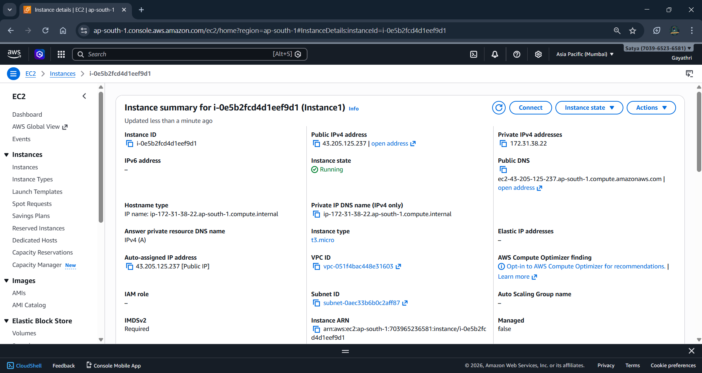
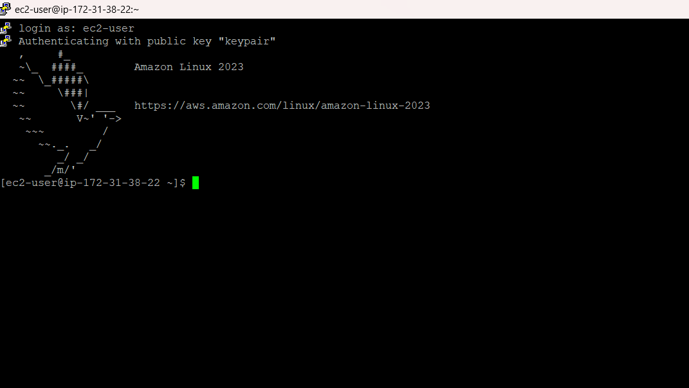
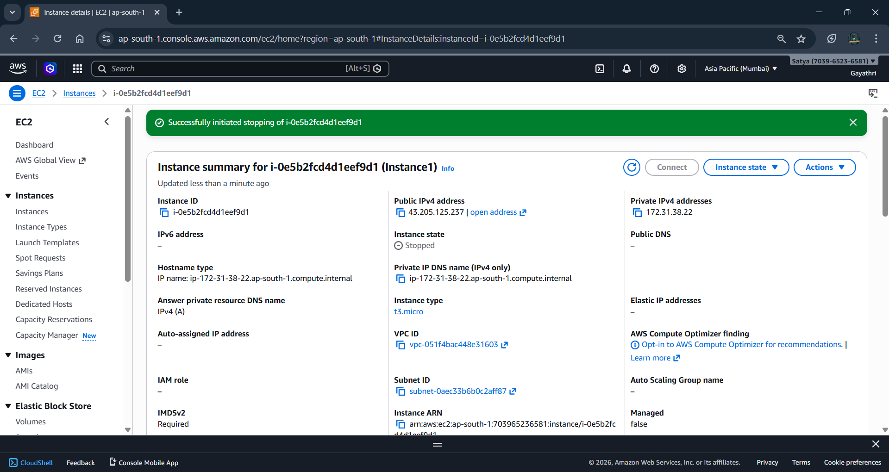
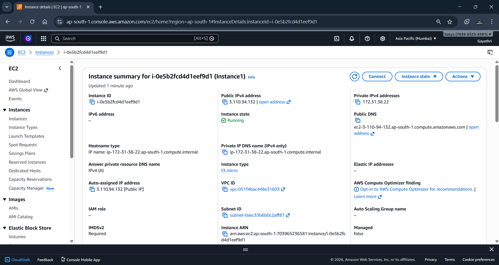
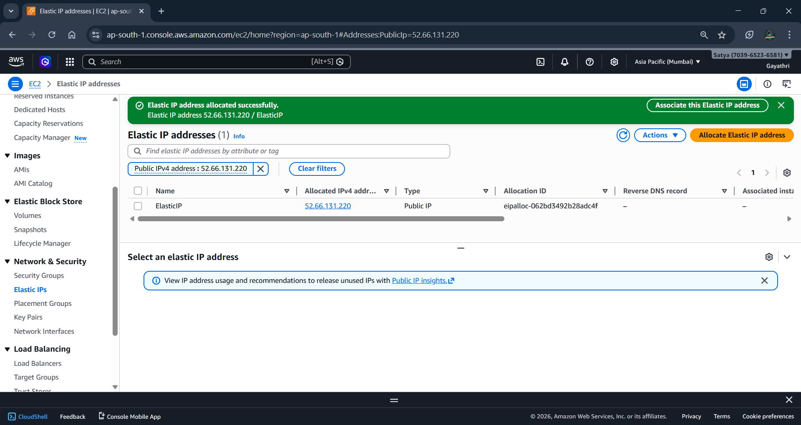
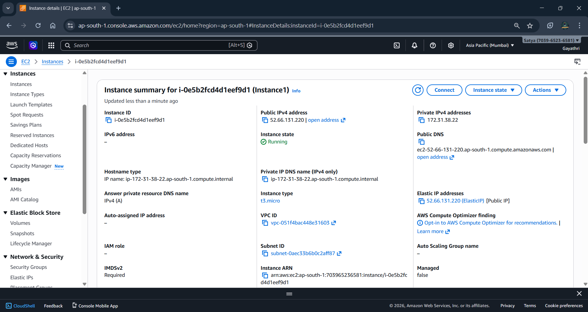
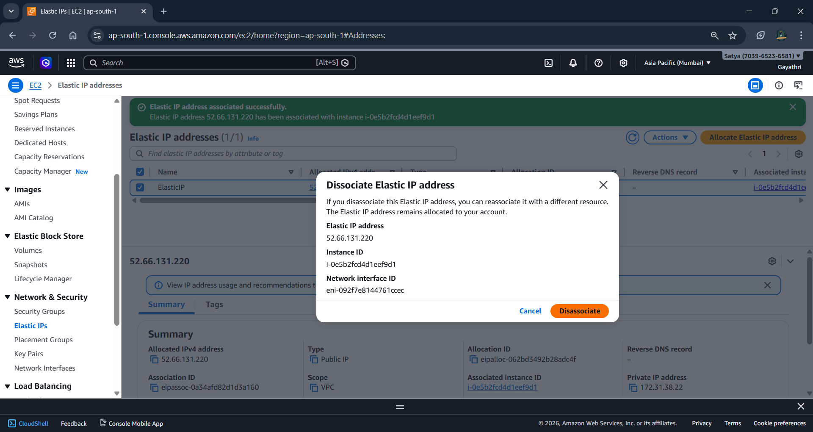
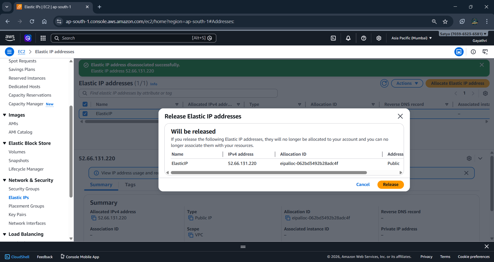
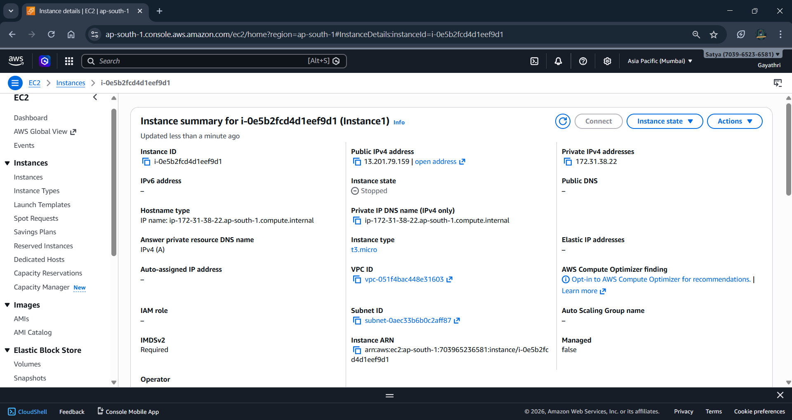

# AWS PublicIP-PrivateIP-ElasticIP

---

## Project Description

This lab demonstrates the concept of **IP addressing in AWS Cloud** using Amazon EC2 instances.  
The project focuses on understanding how AWS assigns and manages **Public IP**, **Private IP**, and **Elastic IP** addresses for cloud resources.
The objective is to learn the difference between dynamic and static IP allocation and how Elastic IP ensures consistent external connectivity.

---

## AWS Services Used

- Amazon EC2
- Elastic IP

---
## Phase 1 — EC2 Instance Creation

### Instance Created

### SSH Login

---

## Phase 2 — Public IP Change After Restart

### Instance Stopped

### Public IP After Restart

---

## Phase 3 — Elastic IP Configuration

### Elastic IP Allocation

Allocated a static public IP from AWS.

### Elastic IP Association

Associated Elastic IP with EC2 instance to maintain a permanent public endpoint.

### Elastic IP Disassociation

### Release Elastic IP 

### After Removing ElasticIP

---

## IP Address Concepts

### Public IP
- Automatically assigned by AWS
- Used for internet communication
- Changes when instance stops and starts

### Private IP
- Used within AWS VPC network
- Enables internal communication between resources
- Remains constant for the instance

### Elastic IP
- Static public IP provided by AWS
- Persists across instance restarts
- Can be reassigned to another instance

---
## Author

**G Gayathri**  
AWS Cloud Learner
